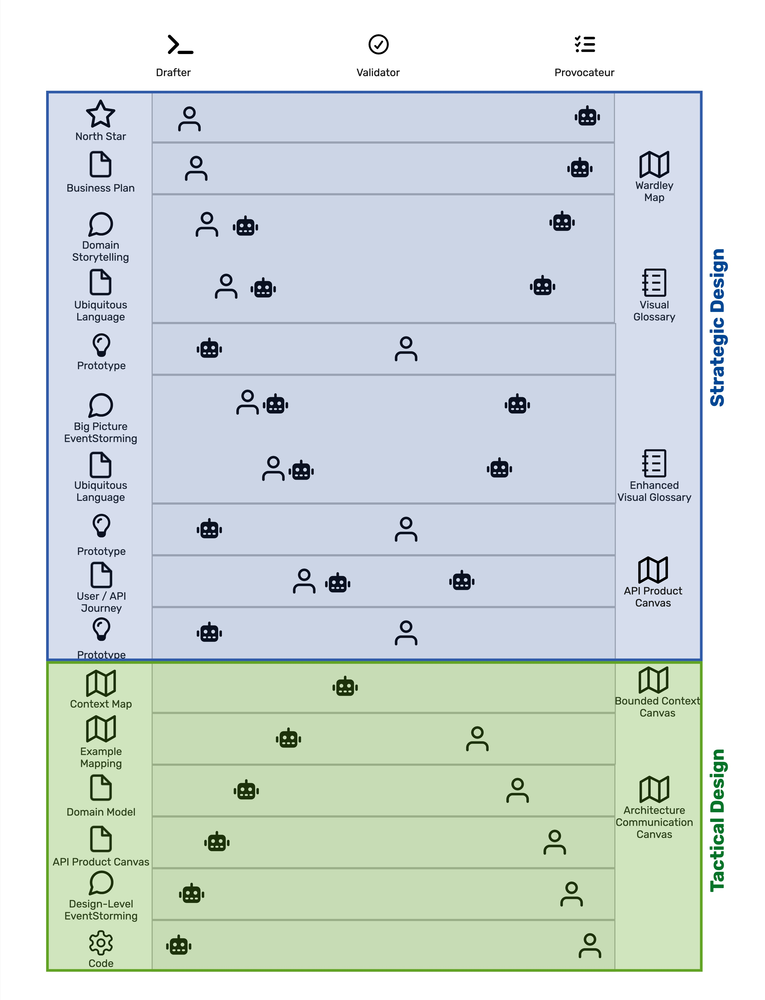

# KI als Design-Partner — Entwerfer, Prüfer, Kritiker

*Teil der Serie* **Domain-Driven Design Meets AI**.
Der vorherige Beitrag stellte den [Synergetic Blueprint](https://www.codecentric.de/en/knowledge-hub/blog/the-synergetic-blueprint-revisited-and-why-ai-changes-everything) als strukturierten Prozess vor, der DDD-Methoden zu einem zusammenhängenden End-to-End-Design-Flow verbindet, und legte dar, dass KI jeden seiner Schritte ergänzt.
Dieser Beitrag konzentriert sich auf die Frage, die sich unmittelbar daraus ergibt: **Was genau tut KI innerhalb eines Blueprint-Schritts — und was bedeutet es, wenn wir sagen, KI „ergänzt" die Arbeit?**

---

## Die falsche Frage

Wenn Teams beginnen, KI für Design-Arbeit einzusetzen, lautet die erste Frage gewöhnlich: *Was kann die KI für uns tun?*

Das ist die falsche Frage.
Die Antwort ist zu allgemein, um nützlich zu sein: KI kann zusammenfassen, generieren, kritisieren, übersetzen, klassifizieren, validieren und ein Dutzend weiterer Dinge — oft innerhalb derselben Konversation.
Die Frage danach, was KI *kann*, verleitet das Team dazu, alles auf das Modell zu werfen und zu hoffen, dass etwas Nützliches zurückkommt.
Genau so landen wir bei selbstbewusst generiertem Unsinn mitten in einem ansonsten rigorosen Design-Prozess.

Eine bessere Frage lautet: *Welche Rolle spielt KI in unserem Entwicklungsprozess in diesem Augenblick?*

Wenn die Rolle benannt ist, weiß das Team, was es vom Output erwarten kann, worauf es achten und wogegen es Einspruch erheben sollte.
Wenn die Rolle unbenannt bleibt, fühlt sich jede KI-Antwort wie ein Orakelspruch an, und das Team vertraut ihr entweder zu sehr oder verwirft sie ganz.

Drei Rollen decken fast alles ab, was KI innerhalb des Synergetic Blueprints tut: **Entwerfer**, **Prüfer** und **Kritiker**.
Sie sind nicht neu.
Jedes Design-Team brauchte immer jemanden, der entwirft, jemanden, der validiert, und jemanden, der herausfordert.
Neu ist, dass jede Rolle nun entweder von einem Menschen oder von einer KI ausgefüllt werden kann — die Rolle bleibt dieselbe, nur der Akteur ändert sich.

>Entscheidend ist hier das 'entweder ... oder'. 
> Ähnlich wie bei Menschen kann man entweder Entwerfer oder Kritiker sein, aber nicht beides gleichzeitig.
> Es ist schwierig, eine Idee zu entwerfen und sie gleichzeitig kritisch zu hinterfragen.
>Es ist einfacher, sich auf eine Rolle zu konzentrieren und eine andere Person die andere Rolle ausfüllen zu lassen.

Die interessante Frage ist nicht, welche Rolle der KI entlang des Synergetic-Blueprint-Prozesses gehört, sondern: **Wer füllt in diesem Schritt welche Rolle aus, und warum?**

---

## Die drei Rollen im Detail

### Entwerfer
Der Entwerfer erzeugt einen Erstentwurf eines Artefakts: eine vorgeschlagene Domain Story (Hofer & Schwentner, 2021), eine OpenAPI-Spezifikation (OpenAPI Initiative, 2025), eine Service-Implementierung.
Der Output des Entwerfers ist konkret genug, um falsch zu sein.
Genau diese Konkretheit ist der Punkt: Ein falscher, aber spezifischer Entwurf lässt sich schneller bewerten, bearbeiten oder verwerfen, als eine leere Seite von Grund auf zu füllen ist.
Der Entwerfer trifft keine Entscheidungen; der Entwerfer erzeugt Material, über das Entscheidungen getroffen werden können.

### Prüfer
Der Prüfer prüft Artefakte auf interne Konsistenz und auf Übereinstimmung mit dem, was bereits bekannt ist.
Stimmt der Begriff *Meal* in der neuen EventStorming-Session (Brandolini, 2023) mit dem *Meal* im Visual Glossary (Zörner, 2015) überein, oder ist er gedriftet?
Setzt die OpenAPI-Spezifikation die im Visual Glossary dokumentierte Ubiquitous Language (Evans, 2003) ein?
Gibt es in der Context Map (Evans, 2003) Bounded Contexts, die weder im Domain Storytelling noch im EventStorming je erwähnt wurden?
Validierung ist Vergleichsarbeit — neue Artefakte werden gegen den bereits angesammelten Bestand geprüft, und Abweichungen werden markiert.

### Kritiker
Der Kritiker stellt Fragen, legt Annahmen offen und fordert Entscheidungen heraus, solange sie noch abwandelbar sind.
*Haben Sie den Fall bedacht, dass zwei Cooks gleichzeitig dasselbe Recipe veröffentlichen?
Warum ist Shipping ein eigener Bounded Context und nicht eine Geschäftsfähigkeit von Sharing?
Was passiert, wenn die Supplier-API eine Woche lang nicht verfügbar ist?*
Der Kritiker entwirft keine Alternativen und prüft keine Konsistenz.
Der Kritiker zwingt das Team, Entscheidungen zu verteidigen, die es im Begriff war, implizit zu treffen.

Die Rollen sind unterscheidbar.
Ein Entwerfer, der zusätzlich Fragen stellt, erledigt zwei Aufgaben in einem Zug.
Ein Prüfer, der Alternativen vorschlägt, hat aufgehört zu validieren und begonnen zu entwerfen.
Die Klarheit ergibt sich daraus, jeden Zug separat zu benennen, auch wenn die Konversation alle drei enthält.

---

## Rollen sind Positionen, keine Akteure

Hier ist der Schritt, der ändert, wie KI in den Blueprint passt: **Die drei Rollen sind Positionen, keine Akteure.**
Entweder ein Mensch oder eine KI kann jede von ihnen ausfüllen, und die richtige Antwort hängt vom Blueprint-Schritt, dem Artefakt und davon ab, was bereits bekannt ist.

Das klingt einfach.
So arbeiten die meisten Teams in der Praxis aber nicht.
Die übliche Annahme lautet: KI ist „der Generator" und Menschen sind „die Reviewer“.
Diese Annahme ist in beide Richtungen falsch.
Es gibt Blueprint-Schritte, in denen KI nicht entwerfen kann, weil die Arbeit Wissen erfordert, das KI nicht hat.
Es gibt Blueprint-Schritte, in denen Menschen nicht entwerfen sollten, weil die Arbeit mechanisch ist und KI sie schneller und konsistenter erledigt.
Prüfer und Kritiker sind ähnlich verteilt — mal validiert die KI, mal die Menschen; mal ist die KI der Advocatus Diaboli, mal der erfahrenste Architekt im Team.

Die folgende Abbildung zeigt, wie sich diese Rollen über den Synergetic Blueprint verteilen.
Die primären Artefakte stehen links, die Rollenverteilung in der Mitte, die abgeleiteten Artefakte rechts.
Strategic Design oben in Blau, Tactical Design unten in Grün.

Die Rollennamen im Diagramm sind in Englisch beschriftet:
*Drafter* steht für *Entwerfer*, *Validator* für *Prüfer*,
*Provocateur* für *Kritiker*.

 

Das Diagramm ist absichtlich informationsdicht.
Es kommuniziert drei Dinge gleichzeitig: Welche Artefakte der Blueprint erzeugt, welche Rollenverteilung in jedem Schritt gilt, und wie sich diese Verteilung verschiebt, während die Arbeit von der Ideenfindung zu lauffähiger Software fortschreitet.
Drei Muster lohnen sich näher zu betrachten.

---

## Muster 1: KI kann keine wirklich neue Idee entwerfen

Am oberen Ende des Blueprint — North Star und Business Plan — sind Menschen die Entwerfer und KI ist der Kritiker.
Das ist keine stilistische Entscheidung.
Es ist eine prinzipielle Grenze dessen, was KI tun kann.

Wenn eine Geschäftsidee wirklich neu ist, enthalten die Trainingsdaten der KI sie nicht.
KI kann nichts generieren, was sie nie gesehen hat.
Alles, was KI für einen North Star vorschlägt, wird eine Rekombination existierender Muster sein — was für Benchmarking nützlich ist, aber aktiv in die Irre führt, wenn das Team versucht, etwas zu bauen, das die Welt noch nicht gesehen hat.
**Wenn KI Ihren North Star entwerfen kann, ist Ihr North Star nicht neu.**
In Brownfield-Projekten kann das hilfreich sein, in Greenfield-Projekten ist es das nicht.

Das bedeutet nicht, dass KI in dieser Phase nutzlos wäre.
KI ist außergewöhnlich gut als Kritiker in der Ideenfindung.
*Welche Kundensegmente ignorieren Sie?
Welches Erlösmodell hat jeder zweiseitige Marktplatz irgendwann übernommen, und warum haben Sie es ausgeschlossen?
Was sind die drei häufigsten Gründe, weshalb Plattformen in Ihrem Bereich in den ersten zwei Jahren scheitern?*
Solche Fragen legen Annahmen offen, die das Team sonst implizit gelassen hätte.
Die Trainingsdaten der KI — genau dieselben, die sie als Entwerfer disqualifizieren — sind genau das, was sie zu einem starken Kritiker macht.
Sie hat mehr gescheiterte Businesspläne gelesen, als ein Mensch jemals lesen kann.

Wenn der Blueprint Domain Storytelling erreicht, sind die neuartigen Entscheidungen bereits getroffen.
Das Team hat entschieden, was es baut.
Die Arbeit verschiebt sich von „Was soll das sein?“ zu „Wie funktioniert es?“, und KI kann die Antwort mitentwerfen.
Eine Domain Story für CookWithUs hat Akteure (Cook, Anonymous User), Arbeitsobjekte (Recipe, Ingredients, Rating) und Aktivitäten (publish, rate, share) (Junker, 2026b).
Keines davon ist eine Domain-Erfindung; es sind Domain-*Ausdrücke*.
KI hat genug Recipe-Sharing-Plattformen gesehen, um eine Kandidaten-Domain-Story zu entwerfen, die das Team in Minuten bearbeiten kann, statt sie über Stunden aufzubauen.

> Natürlich kann KI das in spezifischen Domänen unter Umständen nicht leisten.
> Dann bleibt aber die Rolle des Kritikers für KI reserviert.

Die Übergabe vom Menschen als alleinigem Entwerfer zum gemeinsamen Entwerfer geschieht im Blueprint genau an der Grenze zwischen *Vorhabendefinition* und *Ausarbeitung*.

---

## Muster 2: Der Prototyp als wiederkehrendes Validierungsinstrument

Drei Zeilen im Diagramm sind mit *Prototype* beschriftet — sie folgen auf Domain Storytelling (Hofer & Schwentner, 2021), auf Big Picture EventStorming (Brandolini, 2023) und auf die User- und API-Journey.
In jeder dieser Zeilen ist KI der Entwerfer und Menschen sind der Prüfer.
Das ist ein Muster, das es zu benennen lohnt.

Ein Prototyp ist nicht das auszuliefernde Artefakt.
Das validierte vorgelagerte Artefakt, etwa die Domain Story, ist es.
Der Prototyp ist das *Instrument, das Validierung erst möglich macht*.

Eine Domain Story auf einem Miro-Board ist schwer zu validieren.
Das Team stimmt ihr zu, weil es sie selbst entwickelt hat.
Eine Domain Story, die in einen lauffähigen API-Prototyp mit Stubs für Endpoints und Beispielantworten überführt wurde, ist leichter zu validieren, weil das Team ihm Fragen stellen kann.
*Was passiert, wenn ein Anonymous User versucht zu bewerten?
Akzeptiert das System ein Recipe ohne Ingredients?
Wenn zwei Cooks denselben Recipe-Titel beanspruchen — was gibt die API zurück?*
Der Prototyp kann Lücken in der Domain Story offenlegen, die vorher niemand bemerkt hat (Junker, 2026c).

Dieselbe Schleife läuft nach EventStorming und nach der User- und API-Journey ab.
Jedes Mal entwirft KI einen reichhaltigeren Prototyp, weil die vorgelagerten Artefakte reichhaltiger sind, und jedes Mal validieren die Menschen etwas anderes.
Der erste Prototyp testet die Domain Story.
Der zweite testet die Grenzentscheidungen und den Event-Fluss.
Der dritte Prototyp testet die API- oder User-Journey.
Das wurde empirisch in unserer veröffentlichten drei-Iterations-Prototyping-Pipeline für [CookWithUs](https://www.codecentric.de/en/knowledge-hub/blog/from-domain-story-to-prototype) gezeigt — reichhaltigere Artefakte erzeugten in jedem Schritt messbar vollständigere Prototypen (Junker, 2026c).

Die Lektion ist struktureller Natur und nicht auf Prototypen beschränkt.
Über den gesamten Blueprint hinweg ist der nachgelagerte Entwurf der KI oft die Linse, durch die Menschen ihren vorgelagerten Entwurf validieren.
Ohne den Prototyp kann die Domain Story falsch sein, ohne dass es jemand bemerkt.
Mit ihm wird mögliche Fehlerhaftigkeit sichtbar.

---

## Muster 3: Die taktische Umkehrung

In der unteren Hälfte des Diagramms ist die Rollenverteilung gegenüber der oberen Hälfte umgekehrt.
KI ist der Entwerfer für Context Maps (Evans, 2003), Domänenmodelle, API Product Canvases (Junker & Lazzaretti, 2025), Design-Level EventStorming (Brandolini, 2023) und Code.
Menschen sind Prüfer und Kritiker.

Diese Umkehrung ist nicht willkürlich.
Sie ergibt sich aus der Struktur des Blueprint (Junker, 2026a).
Tactical Design ist dem Strategic Design nachgelagert.
Wenn das Team ein Domänenmodell entwirft, liegen bereits Artefakte wie das Visual Glossary, das EventStorming-Board, die Context Map und die API-Journey vor.
KI verfügt nun über einen reichen, projektspezifischen Kontext, der in der oberen Hälfte des Blueprint nicht existierte.
Mit diesem Kontext kann KI taktische Artefakte mit hoher Zuverlässigkeit entwerfen: Events in Aggregat-Kandidaten gruppieren, Entitäten von Value Objects unterscheiden, Context-Map-Integrationsmuster mit expliziter Begründung vorschlagen, OpenAPI-Endpoints aus Aggregaten ableiten.

Was Menschen in dieser Phase einbringen, ist Urteilsvermögen.
Die Aggregat-Grenzen, die die KI vorschlägt, sind *plausibel* — aber plausibel ist nicht dasselbe wie *richtig*.
Ob *ShoppingItem* eine Entität innerhalb des *ShoppingList*-Aggregats ist oder ein Value Object, das die Liste enthält, ist eine Domänenentscheidung, keine strukturelle — und KI kann sie nicht treffen.
Die menschliche Rolle wird zum Kritiker: gegen den Entwurf der KI argumentieren, für jede Grenze eine Begründung verlangen, Invarianten zurückweisen, die vernünftig aussehen, aber Geschäftsregeln widersprechen.

Der Blueprint schreitet voran von „Menschen entwerfen, KI kritisiert" über „Menschen und KI entwerfen gemeinsam“ zu „KI entwirft, Menschen kritisieren“.
Die Rollen bleiben dieselben; die Akteure, die sie ausfüllen, wechseln.

---

## Was sich durchzieht

Der Prüfer wandert nicht mit dem Blueprint mit, wie es Entwerfer und Kritiker tun.
Validierung läuft kontinuierlich und gleicht jedes neue Artefakt mit allem ab, was vorher kam.

In CookWithUs erschien der Begriff *Making* in der ursprünglichen Domain Story und wurde später im überarbeiteten Visual Glossary in *HowTo* umbenannt.
Eine solche Umbenennung ist die Art von Änderung, die sich stillschweigend durch nachfolgende Artefakte fortpflanzt, wenn es niemand prüft.
KI als Prüfer kann jedes nachgelagerte Artefakt scannen — EventStorming-Stickies, OpenAPI-Felder, Domänenmodell-Code, API-Product-Canvas-Einträge — und jede Stelle markieren, an der *Making* noch erscheint.
Das ist mechanische Arbeit, die bei jeder Änderung von Hand zu teuer wäre — und genau die Art von Arbeit, die KI zuverlässig erledigt.

Validierung hat einen anderen Rhythmus als Entwerfen oder Kritik.
Entwerfen geschieht am Anfang jedes Blueprint-Schritts.
Kritik geschieht mittendrin, während Entscheidungen noch nicht fest sind.
Validierung geschieht *die ganze Zeit*, im Hintergrund, als Disziplin.
Es ist die Rolle, die am ehesten stillschweigend vergessen wird — und diejenige, deren Fehlen die größten nachgelagerten Schulden erzeugt.

---

## Das Kernargument

Die drei Rollen — Entwerfer, Prüfer, Kritiker — geben dem Team ein Vokabular für KI-unterstütztes Modellieren, das präziser ist als „KI für X einsetzen“ und flexibler als „KI ersetzt Y“.
Sie benennen, was in jedem Zug der Konversation geschieht, und verteilen Verantwortung angemessen zwischen Menschen und KI.

Das tiefere Argument handelt von *Position*, nicht spezifisch von KI.
**Während der Blueprint voranschreitet, ändern sich die Rollen nicht. Wer sie ausfüllt, ändert sich.**
Menschen entwerfen am oberen Ende, weil Neuheit in Menschen lebt.
Menschen und KI entwerfen in der Mitte gemeinsam, weil Ausdruck sowohl von Domänenwissen als auch von Mustererkennung profitiert.
KI entwirft im Tactical Design, weil die strategischen Artefakte nun genug Kontext liefern, damit KI zuverlässig ist.
Prüfer und Kritiker laufen durchgängig mit, wobei der Akteur davon abhängt, was geprüft und was hinterfragt wird.

Dieser Rahmen hat einen praktischen Nutzen.
Wenn ein Team sich zusammensetzt, um KI in einem Blueprint-Schritt einzusetzen, lautet die erste Frage nicht mehr: *Was kann KI hier für uns tun?*
Sondern: *Welche Rolle muss gerade besetzt werden, und ist KI oder ein Mensch im Moment besser dafür geeignet?*
Diese Frage hat eine Antwort.
Die andere meistens nicht.

*Als Nächstes in dieser Serie:* **Fünf Prinzipien für KI-unterstütztes DDD** *— das Collaboration Cheat Sheet, das die Rollenverteilung in eine funktionierende Disziplin überführt.
Wann KI-Output zu vertrauen ist, wann er hinterfragt werden muss, und wie der Mensch fest im Zentrum jedes Blueprint-Schritts bleibt.*

---

## References

Brandolini, A. (2023). *EventStorming*.  EventStorming. https://www.eventstorming.com/,
abgerufen 04 2026

Evans, E. (2003). *Domain-driven design: Tackling complexity in the heart of software*. Addison-Wesley.

Hofer, S., & Schwentner, H. (2021). *Domain Storytelling: A Collaborative, Visual, and Agile Way to Build Domain-Driven Software*. Pearson International.

Junker, A., & Lazzaretti, F. (2025). *Crafting great APIs with domain-driven design*. Apress.

Junker, A. (2026a). *DDD Toolbox*. BPB Publications.

Junker, A. (2026b, March 4). *From stories to code: How domain storytelling and EventStorming give LLMs the context they need*. codecentric AG. https://www.codecentric.de/en/knowledge-hub/blog/from-stories-to-code-how-domain-storytelling-and-eventstorming-give-llms-the-context-they-need, abgerufen 05 2026. 

Junker, A. (2026c, April 2). *From domain story to prototype: Specification-driven prototyping in DDD workshops*. codecentric AG. https://www.codecentric.de/en/knowledge-hub/blog/from-domain-story-to-prototype, abgerufen 05 2026.

OpenAPI Initiative. (2025). *The World's Most Widely Used API Description Standard*. OpenAPI Initiative. https://www.openapis.org/ (Linux Foundation Project), abgerufen 03 2026.

Zörner, S. (2015). *Softwarearchitekturen dokumentieren und kommunizieren, Entwürfe, Entscheidungen und Lösungen nachvollziehbar und wirkungsvoll festhalten (Document and Communicate Software Architectures: Traceable and Effective Capturing of Decisions and Solutions)*. München: Carl Hanser Verlag.

