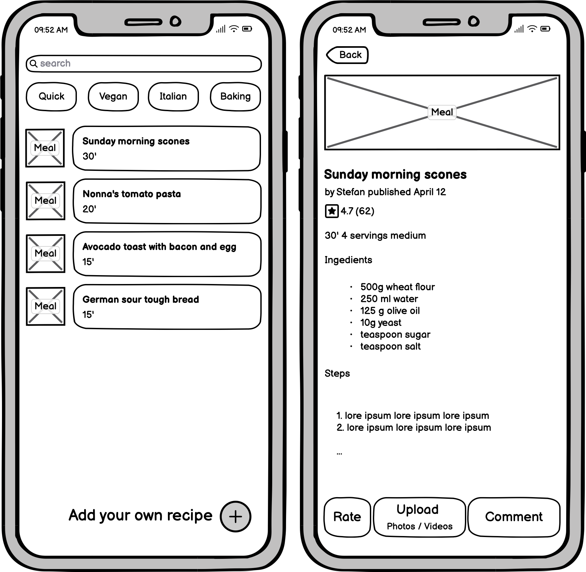

:::{custom-style="CHAPTER NUMBER"}
Chapter 1
:::

:::{custom-style="Chapter Title"}
The Synergetic Blueprint Revisited
:::

:::{custom-style="Body Text First"}
Eric Evans introduced Domain-Driven Design (DDD) as a cornerstone of software design in 2003 [@evans2003ddd].
Since then, the DDD community has developed a rich set of practices and patterns to help teams design software that truly reflects the business domain.
Using generative Artificial Intelligence (AI) in software design and architecture is a natural next step in this evolution. However, it requires a structured process to ensure that AI output is relevant and actionable, as outlined in the Synergetic Blueprint [@junker2026toolbox].
Moreover, it requires a clear understanding and implementation of the domain in question.
When AI meets DDD, the context required by AI is provided by rich models created through a collaborative, iterative process, feeding the generative AI the necessary context.
:::

# The Monday morning problem

:::{custom-style="Body Text First"}
Domain-driven design workshops are often the most exciting part of a project — the room buzzes with insight, the whiteboard fills with clarity, and the team leaves energized.
But then comes Monday morning: how do we translate that insight into software?
The gap between workshop output and delivered software is where many projects falter.
The Synergetic Blueprint was designed to bridge that gap, but it can feel abstract without a concrete example.
It was first introduced by Junker in 2025 [@junker2025mastering] and further developed by Lazzaretti [@junker2025crafting]. The version used here was presented in DDD Toolbox [@junker2026toolbox].
In this book, we will revisit the Blueprint through the lens of CookWithUs, a fictional cooking app that will serve as our companion domain throughout.
We will see how AI does not replace the Blueprint but rather reveals where it was always waiting for richer input.
:::

# Synergetic Blueprint in a nutshell

:::{custom-style="Body Text First"}
The Synergetic Blueprint is a structured process that guides teams from business intent to running software.
:::

## Strategic design part of the Synergetic Blueprint

:::{custom-style="Body Text First"}
The strategic part of the Blueprint is shown in Figure 1-1.
:::

:::{custom-style="Figure"}

:::
:::{custom-style="Figure Caption"}
Figure 1-1: The strategic part of the Synergetic Blueprint
:::

:::{custom-style="Body Text First"}
It consists of three zones — Ideation, Requirements, and Solution Design — and fourteen steps that iteratively frame the problem space and define the solution space.
The Blueprint emphasizes the importance of context in AI-augmented software development, ensuring that AI output is relevant and actionable.

_*Step 1: Define the business intent*_

The problem to be solved and the value to be created must be defined.
We can define a North Star Metric to align the teams around a single measure of success [@ellis2017hacking; @ellis2017northstar].
The workshops can use Brainstorming or Brainwriting, or leverage AI to generate ideas and structure them [@osborn1953applied; @miller2012quick].

_*Step 2: Lay out a plan*_

In a second step, a business plan is created to define the steps to reach the business intent.
The plan can be created using techniques such as the Business Model Canvas [@osterwalder2010business] or the Lean Canvas [@maurya2012running].
The AI can be used to generate ideas for the business plan and to structure them.

_*Step 3: Define the domain*_

The domain is defined by the prioritization and structuring of the business capabilities.
The domain is further detailed using techniques like Impact Mapping [@adzic2012impact] or capability maps [@moser2025capability; @opengroup2022togaf].

AI helps structure and generate ideas for group discussion.

Moreover, the capabilities, including their functions, that fulfill user requirements, need to be prioritized.
A highly effective technique is the Wardley Map, which prioritizes functions and software implementations based on their value and maturity [@wardley2022maps].

_*Step 4: Gather business requirements*_

Business requirements are gathered and structured for software development.
Techniques such as Domain Storytelling can be used [@hofer2021storytelling].

AI can be used to generate and structure the business requirements based on the domain story and the business plan. It helps facilitators to prepare and debrief corresponding workshops.

_*Step 5: Define the ubiquitous language*_

The ubiquitous language is one of the cornerstones of DDD and the Blueprint. It is defined by the terms and concepts that are used to describe the domain and the software.
A Visual Glossary accompanied by Domain Storytelling and EventStorming is highly useful throughout the entire development process [@zoerner2021architekturen].

The creation of the Visual Glossary can be supported by AI by collecting work items and actors from the domain story to build the glossary.

_*Step 6: Define bounded contexts*_

Bounded contexts can be defined by Big Picture EventStorming [@brandolini_eventstorming_web; @brandolini2021eventstorming].

AI can support the process by proposing events based on the domain story and proposing bounded contexts based on the events and the ubiquitous language.

_*Step 7: Refine the ubiquitous language*_

During the EventStorming process, new terms and concepts are determined, and the ubiquitous language is further detailed using the Visual Glossary.

_*Step 8: Explore the API and user journey*_

The API and user journeys are explored to define the software solution. The journey and affected systems can be explored using Event Modeling [@dilger2024understanding].

AI can support the process by proposing API and user journeys based on the domain story, the ubiquitous language, and the defined bounded contexts. Usually, existing systems to be used, e.g., an Input Management System, can be proposed as well, when they are part of the AI context.

_*Step 9: Define the services and APIs*_

Business experts and IT specialists together define services and APIs based on the ubiquitous language and the defined bounded contexts in a context map.
They use known DDD patterns as an Open Host Service, an Anti-Corruption Layer, or the Conformist pattern [@evans2003ddd].

Further patterns can be used to define the microservice environment, such as choreography, orchestration, CQRS, event-driven architecture, or event sourcing [@microsoft2025choreography; @bhardwaj2023orchestration; @richardson2019microservices; @davis2019cloudnative; @skrzymowski2024eda; @richardson2025eventsourcing].
Those services can be deployed as a modular monolith [@garg2023modular].

AI supports the design of the solution architecture by proposing a certain pattern for a certain problem.

:::

## Tactical design part of the Synergetic Blueprint

:::{custom-style="Body Text First"}
The tactical design part falls under the solution area and comprises two zones: Acceptance Criteria and Testing and Solution Design. It is done inside a bounded context team and is shown in Figure 1-2.
:::

::: {custom-style="Figure"}

:::
:::{custom-style="Figure Caption"}
Figure 1-2: The tactical part of the Synergetic Blueprint
:::

:::{custom-style="Body Text First"}

_*Step 10: Define test cases*_

To define test cases, the Example Mapping technique can be used [@smart2023bdd, @vankelle2024collaborative].

It is even more important to give a generative AI an appropriate harness [@emrich2026exact].

_*Step 11: Define domain model*_

Using the enhanced Visual Glossary with the refined Ubiquitous Language, the domain model is defined. It contains aggregates, entities, value objects, and domain events [@evans2003ddd].

_*Step 12: Define REST APIs*_

The REST APIs are defined based on the domain model and the API Product Canvas [@junker_apicanvas; @junker2025crafting].
It uses the refined ubiquitous language, too.

AI can generate an OpenAPI or AsyncAPI specifications from the domain model and the API Product Canvas [@openapi2025spec; @asyncapi2024spec].

_*Step 13: Define service architecture*_

The internal service architecture is defined based on the domain model and a Design-Level EventStorming [@evans2003ddd;@brandolini_eventstorming_web].

_*Step 14: Define repositories*_

Repositories used in the service can be defined based on the domain model and enhanced ubiquitous language [@evans2003ddd].
AI supports this step in generating the necessary code.

Those steps will be explained throughout the book, using the companion domain CookWithUs.
:::

# CookWithUs Blueprint flow

:::{custom-style="Body Text First"}
CookWithUs connects home cooks to share and discover recipes from the community. 
We use this fictional platform throughout the book to demonstrate the Synergetic Blueprint and its AI augmentation.
Figure 1-3 shows the two screens that anchor the idea.
:::

::: {custom-style="Figure"}

:::
:::{custom-style="Figure Caption"}
Figure 1-3: Sketches of a CookWithUs recipe sharing platform
:::

:::{custom-style="Body Text First"}
The feed lets readers browse, search, and filter by category (e.g., Quick, Vegan, Italian, Baking), and tap into any recipe to see the dish, ingredients, and steps as published by the author. 
The feed's main action is _Add your own recipe_, placing consumption and contribution on equal footing.
Each published recipe then becomes a focal point for community engagement: cooks who try it can rate it, leave comments, and upload their own photos or videos of the result.
A recipe is therefore a living artifact, authored once and continually enriched by everyone who cooks it.
This premise introduces enough domain complexity to carry the rest of the book: questions of authorship, attribution, discovery, and moderation that the Synergetic Blueprint and its AI augmentation will help us frame.
:::

# AI augments the Blueprint

:::{custom-style="Body Text First"}
AI can augment each step of the Blueprint, as we will see throughout the book.

During the ideation process, AI can deliver additional ideas and steer the discussion.

During the requirement gathering process, AI can the facilitators in preparing and following-up the workshops.Moreover, it helps to change the format used, e.g., from a remote whiteboard picture format to a format that is easily searchable and which can be stored in a version control system.

During the solution design process, AI can propose solution architectures based on the defined domain and the ubiquitous language, and it helps to generate the necessary code for the implementation.

We will explore the entire process in detail throughout the book, using the companion domain CookWithUs to demonstrate how AI can augment the Synergetic Blueprint at each step.
:::

# How to read this book

:::{custom-style="Body Text First"}
This book is structured around the Synergetic Blueprint, with each chapter focusing on a specific step in the process.

We will give different perspectives on the Blueprint, starting with the strategic design part and then moving to the tactical design part.
Each step describes in detail how AI can augment the process, and we will use the companion domain CookWithUs to demonstrate the concepts in a concrete way.

Whereas in this first part, we lay the foundation how to use AI in a collaborative software design process.

We will describe in the next parts how to use AI in the different steps of the Blueprint, starting with the ideation process with North Star Metric and capability mapping.
Part III describes the requirements gathering and Part IV the strategic design part.
We will move to the tactical design part in Part V.
We will describe how to use AI in the definition of test cases, domain models, REST APIs, service architecture, and repositories.

In all parts, we will use the model of the recipe sharing platform CookWithUs.
The used prompts, skills, and agents will be described in detail, and we will give recommendations on how to use them in practice.
All assets are accessible in a [public repository](https://github.com/Grinseteddy/SamplesDddMeetAi).
:::

```{=openxml}
<w:p><w:r><w:br w:type="page"/></w:r></w:p>
```

::: {custom-style="Chapter Title"}
References
:::

::: {#refs}
:::

```{=openxml}
<w:p><w:r><w:br w:type="page"/></w:r></w:p>
```
