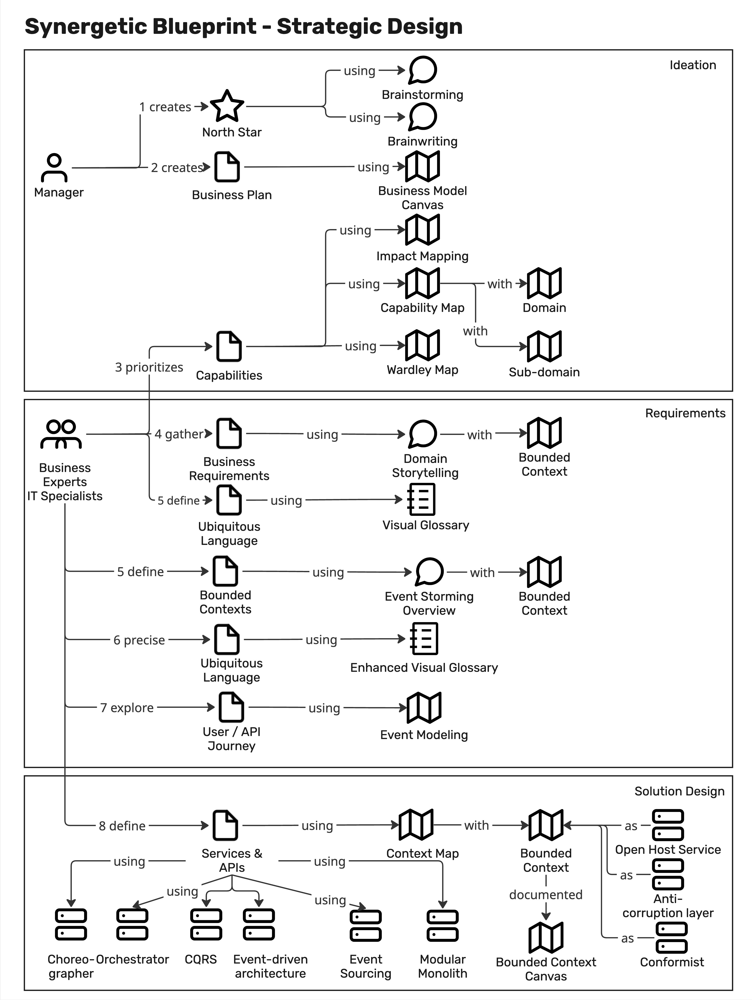
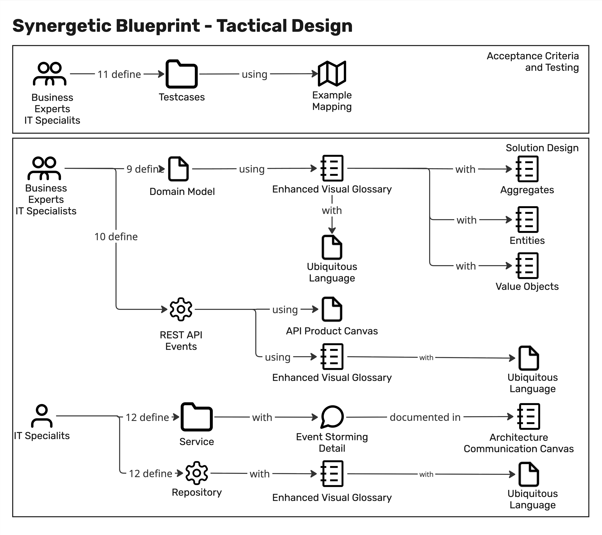

::: {custom-style="CHAPTER NUMBER"}
Chapter 1
:::

::: {custom-style="Chapter Title"}
The Synergetic Blueprint Revisited
:::

> _*TO BE DELETED*_:
> 
>Orient readers in the Synergetic Blueprint without requiring the previous books. Introduce CookWithUs as the companion domain. State the book's central claim: AI doesn't replace the Blueprint — it reveals where the Blueprint was always waiting for richer input.
>1. The Monday Morning Problem — the gap between workshop insight and delivered software
>2.	The Synergetic Blueprint in a Nutshell — three zones, twelve steps, iterative framing
>3.	The Blueprint Flow — full diagram with CookWithUs artifacts at each step
>4.	AI Augments the Blueprint — three previews of AI augmentation in CookWithUs
>5.	Meet CookWithUs — actors, work objects, business rules, bounded contexts
>6.	How to Read This Book — navigation guide 


# The Monday morning problem

:::{custom-style="Body Text First"}
Domain-driven design workshops are often the most exciting part of a project — the room buzzes with insight, the whiteboard fills with clarity, and the team leaves energized.
But then comes Monday morning: how do we translate that insight into software?
The gap between workshop output and delivered software is where many projects falter.
The Synergetic Blueprint was designed to bridge that gap, but it can feel abstract without a concrete example. It was first introduced by _Junker_ in 2025 [@junker2025mastering] and developed further with  _Lazzaretti_ [@junker2025crafting]. The version used here was presented in _"DDD Toolbox"_ [@junker2026toolbox]. 
In this book, we will revisit the Blueprint through the lens of CookWithUs, a fictional cooking app that will serve as our companion domain throughout.
We will see how AI does not replace the Blueprint but rather reveals where it was always waiting for richer input.
:::

# Synergetic Blueprint in a nutshell
:::{custom-style="Body Text First"}
The Synergetic Blueprint is a structured process that guides teams from business intent to running software. 
:::

## Strategic design part of the Synergetic Blueprint

:::{custom-style="Body Text First"}
The strategic part of the Blueprint is shown in Figure 1-1.
:::

::: {custom-style="Figure"}

:::
:::{custom-style="Figure Caption"}
Figure 1-1: The strategic part of the Synergetic Blueprint
:::

:::{custom-style="Body Text First"}
It consists of three zones — Intent, Structure, and Delivery — and fourteen steps that iteratively frame the problem space and define the solution space.
The Blueprint emphasizes the importance of context in AI-augmented software development, ensuring that AI output is relevant and actionable.

_*Step 1: Define the business intent*_

The problem which needs to be solved and the value which will be created must be defined.
We can define a North Star Metric to align the teams around a single measure of success [@ellis2017hacking; @ellis2017northstar].
The workshops can be done with techniques of Brainstorming or Brainwriting or with the help of the AI to generate ideas and structure them [@osborn1953applied; @miller2012quick].

_*Step 2: Lay out a plan*_

In a second step, a business plan is created to define the steps to reach the business intent.
The plan can be created with the help of techniques such as Business Model Canvas [@osterwalder2010business] or Lean Canvas [@maurya2012running].
The AI can be used to generate ideas for the business plan and to structure them.

_*Step 3: Define the domain*_

The is defined by the prioritization and structuring of the business capabilities.
The domain is further detailed using techniques like _Impact Mapping_ [@adzic2012impact] or capability maps [@moser2025capability; @opengroup2022togaf].

AI is helping to structure and generate ideas which can be discussed in the group.

Moreover, the capabilities including their functions fulfilling user requirements need to be prioritized.
A highly effective technique to do so is a _Wardley Map_ where functions and implementing sofware can be prioritized based on their value and maturity [@wardley2022maps].

_*Step 4: Gather business requirements*_

Business requirements are gathered and structured in a way that they can be used for software development.
Techniques such as _Domain Storytelling_ can be used [@hofer2021storytelling].

AI can be used to generate and structure the business requirements based on the domain story and the business plan. It helps facilitators to prepare and debrief corresponding workshops.

_*Step 5: Define the ubiquitous language*_

The ubiquitous language is one of the center stones of DDD and the Blueprint. It is defined by the terms and concepts that are used to describe the domain and the software.
A _Visual Glossary_ accompanied by Domain Storytelling and Event Storming is highly useful throughout the entire development process [@zoerner2021architekturen].

The creation of the Visual Glossary can be supported by AI by collecting work items and actors out of the domain story to create the glossary.

_*Step: 6: Define bounded contexts*_

Bounded contexts can be defined by EventStorming as overview [@brandolini_eventstorming_web; @brandolini2021eventstorming].

AI can support the process by proposing events based on the domain story and proposing bounded contexts based on the events and the ubiquitous language.

_*Step 7: Precise the ubiquitous language*_

During the EventStorming process, new terms and concepts are determined and the ubiquitous language is further detailed using the Visual Glossary.

_*Step 8: Explore the API and user journey*_

The API and/or user journey are explored to define the software solution. The journey and affected systems can be explored using the technique of Event Modeling [@dilger2024understanding]

AI can support the process by proposing API and user journeys based on the domain story, the ubiquitous language and the defined bounded contexts. Usually, existing systems to be used e.g. like an Input Management System can be proposed as well, when they are part of the AI context.

_*Step 9: Define the services and APIs*_

Business experts and IT specialists together define the services and APIs based on the ubiquitous language, the defined bounded contexts in a context map.
They use known pattern of DDD as an Open Host Service, an Anti-Corruption Layer or the conformist pattern [@evans2003ddd].

Further pattern can be used to define the microservice environment like choreographer, orchestrator, CQRS, event-driven architecture, or event-sourcing [@microsoft2025choreography; @bhardwaj2023orchestration,@richardson2019microservices; @davis2019cloudnative; @skrzymowski2024eda; @richardson2025eventsourcing].
Those services can be deployed as a modular monolith [@garg2023modular].

AI supports the design of the solution architecture by proposing certain pattern for certain problems.

:::

## Tactical design part of the Synergetic Blueprint

:::{custom-style="Body Text First"}
The tactical design part is done inside a bounded context and is shown in Figure 1-2.
:::

::: {custom-style="Figure"}

:::
:::{custom-style="Figure Caption"}
Figure 1-2: The tactical part of the Synergetic Blueprint
:::

:::{custom-style="Body Text First"}
_*Step 10: Define test cases*_

To define test cases the technique of Example Mapping can be used [@smart2023bdd, @vankelle2024collaborative].

It is even more important to give a generative AI an approciate harness [@emrich2026exact].

_*Step 11: Define domain model*_

Using the enhanced Visual Glossary with the refined Ubiquitous Language, the domain model is defined. It contains aggregates, entities, value objects, and domain events [@evans2003ddd].

_*Step 12: Define REST APIs*_

The REST APIs are defined based on the domain model and the API Product Canvas [@junker_apicanvas;@junker2025crafting].
It uses the refined ubiquitous language too.

AI can be used to generate the OpenAI specification based on the domain model and the API Product Canvas.

_*Step 13: Define service architecture*_

The internal service architecture is defined based on the domain model and a detail EventStorming [@evans2003ddd;@brandolini_eventstorming_web].

Repositories used in the service can be defined based on the domain model and enhanced ubiquitous language [@evans2003ddd].
AI supports this step in generating the necessary code.

Those steps will be explained throughout the book with the help of the companion domain CookWithUs.
:::

# CookWithUs Blueprint flow

# AI augments the Blueprint

# How to read this book

```{=openxml}
<w:p><w:r><w:br w:type="page"/></w:r></w:p>
```

::: {custom-style="FM Head"}
References
:::

::: {#refs}
:::

```{=openxml}
<w:p><w:r><w:br w:type="page"/></w:r></w:p>
```


