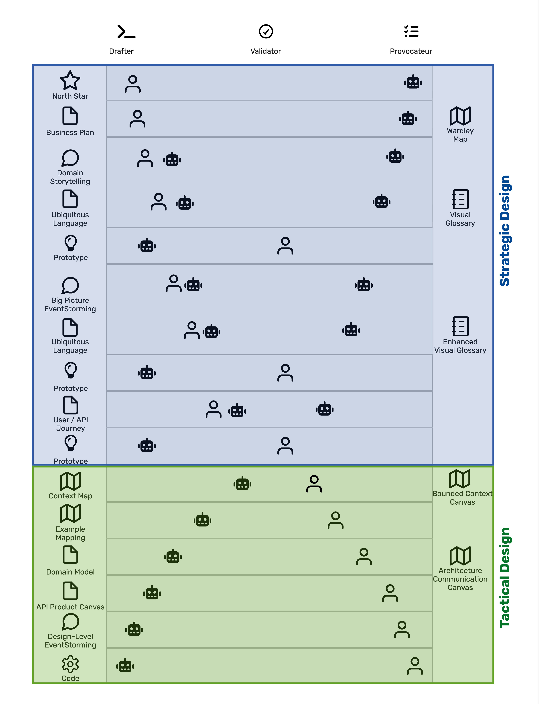

::: {custom-style="CHAPTER NUMBER"}
Chapter 2
:::

::: {#ch02-ai-as-design-partner custom-style="Chapter Title"}
AI as Design Partner
:::

[//]:Establish what AI actually does in a modeling context — as Validator, Accelerator, and Provocateur — and where it breaks down. Give the reader the mental model they carry into every subsequent chapter.

[//]:1.	The Broken Promise — why AI code generation fails without domain context
[//]:2.	Context Is Everything — how LLMs work and why Blueprint artifacts are unusually good input
[//]:3.	AI as Validator, Accelerator, and Provocateur — the three roles with CookWithUs demonstrations
[//]:4.	When AI Gets It Wrong — failure modes named plainly; the self-rating rule as the canonical example
[//]:5.	Giving AI the Right Context — the three-ingredient formula
[//]:6.	AI as the Most Knowledgeable Junior Colleague — the mental model

::: {custom-style="Body Text First"}
Usually, we just think that AI can do everything to build a software system.
The developers are not needed anymore.
In early 2023, Matt Welsh argued in Communications of the ACM that classical programming was ending, with the field 'waiting for the meteor to hit [@welsh2023endprogramming]. 
A year later, Nvidia CEO Jensen Huang told the World Governments Summit that 'nobody has to program' anymore [@caulfield2024sovereign].
Such predictions framed the public conversation about AI and software development for the years that followed.
Such predictions set the terms of the conversation.
They were wrong about what AI actually does inside design work, and getting the role right is the question this chapter answers.

AI can help developers and architects in their work, but it cannot replace them [@hou2024llmse;@liu2024nofinger].
AI can play different in the development process, but it cannot take over the entire process.
However, it cannot play all roles at the same time.
In this chapter, we will explore the roles that AI can play in the development process and how to use it effectively.
:::

# The Broken Promise

::: {custom-style="Body Text First"}
When AI code generation first became available, it was hailed as a game-changer for software development .
And still the hype is pushed [@hou2024llmse;@haque2025llms].
The promise was that developers could simply describe what they wanted in natural language, and the AI would generate the code for them.
However, this promise has largely failed to materialize in practice.

AI tends to hallucinate code that looked syntactically correct but was semantically meaningless [@kalai2025hallucinate].
AI never answers 'I do not have enough business information to generate this code' or 'I do not understand the problem well enough to generate this code.'
AI is eager to help, but it is well-read, however inexperienced, and will not admit when it does not know something[@boeckeler2023unreliability].  
Instead, it generated code that looked plausible but was often wrong, leading to wasted time and frustration for developers.
Boeckeler introduced a stupporn monkey persona to capture this dynamic [@boeckeler2023unreliability].
In this book, we will use a similar mental model, but we will focus on the eagerness rather than the stubbornness, since the former is more relevant to design work.
Therefore, we will use the metaphor of a young robot puppy that is eager to help but easily to be distracted, e.g., by a butterfly, however, well-read it is.

Design work depends on reliability even more, because it is harder to change [@booch2006design]. 
When teams first started using AI for design, they expected it to generate perfect designs based on their input.
But instead, they got designs that looked good on the surface, however, were often flawed in ways that only became clear after careful review.

They tried to perfect their prompts, but no matter how much they tweaked the input, the AI continued to produce unsatisfactory results.
If we create an architecture and ask AI to do it, the result looks promising.
However, when we look closer, we find that the AI has made assumptions that are not aligned with our understanding of the problem,e.g. we never assumed cookbooks as part of the solution, but AI generated it because it is a common pattern in the training data.
The following extract of a chat shows that problem[^1].

:::

:::{custom-style="Footer Text"}
[^1]: The whole chat can be found in the code repository of this book, in the file [Design Example Claude Opus 4.7](https://github.com/Grinseteddy/SamplesDddMeetAi/blob/main/Chapter02/DesignExampleClaudeOpus47.md) and [Design Example GPT 4.0](https://github.com/Grinseteddy/SamplesDddMeetAi/blob/main/Chapter02/DesignExampleGpt40.md).
:::

:::{custom-style="Code"}
<br>
5. Key Services

   Recipe Service: CRUD for recipes, versioning, event publishing.
   
   Identity Service: User registration, login, roles.
   
   Social Service: Likes, comments, follows, ratings.
   
   Discovery Service: Search indexing, recommendations.
   
   Collections Service: Favorites, cookbooks, meal plans.

   Notification Service: Event-based notifications.

   Media Service: Upload, resize, store media.
   
   Moderation Service: Content reporting, admin review.
:::

The problem was not with the AI itself, but with the way teams were using it.


::: {custom-style="Body Text First"}

## The wrong question

::: {custom-style="Body Text First"}
When teams start using AI for design work, the first question is: What can AI do for us?

It is the wrong question. 
The answer is too broad to be useful: AI can summarize, generate, critique, translate, classify, validate, and a dozen other things, often within the same conversation. 
Asking what AI can do invites the team to throw everything at the model and hope something useful comes back. 
That is exactly how we end up with confidently generated nonsense in the middle of an otherwise rigorous design process.

A better question is: What role is AI playing in our development process right now?
When the role is named, the team knows what to expect from the output, what to check for, and what to push back on.
When the role is unnamed, every AI response feels like a Delphic pronouncement, and the team over-trusts it or dismisses it.

Three roles cover almost everything AI does inside the Synergetic Blueprint (as already mentioned in [Chapter 1](#ch01-synergetic-blueprint)): Drafter, Validator, and Provocateur.
They are not new.
Every design team has always needed someone drafting, someone validating, and someone challenging.
Brooks and Frederick defined the roles as Surgeon, Copilot, and Tester in his groundbreaking *Mythical Man-Month* already in 1975 [@brooks1975mythical; @brooks1995mythical].
There are slight differences.
We will explain them when we describe the roles in more detail in the section [AI as Validator, Drafter, and Provocateur](#ai-as-validator-drafter-and-provocateur).
What is new is that each role can now be filled by either a human or AI — the role stays the same; only the actor changes.

The important term here is 'either ... or.'
As with people, one can be either a drafter or a provocateur, but not both at the same time.
It is hard to draft an idea and question it at the same time.
It is easier to focus on one role and let someone else fill the other.

# AI as Validator, Drafter, and Provocateur

We see the three roles of AI in design work Drafter, Validator, and Provocateur.

Brooks' surgical team gave each cognitive contribution to a separate person [@brooks1975mythical; @brooks1995mythical].
Half a century later, AI-assisted development confirms his core insight that the cognitive work of producing software decomposes into distinct kinds of activity.
In our framing, those activities are drafting, challenging, and validating.
What has changed is the assignment.
The work still splits cleanly along the seams Brooks identified, but those contributions no longer have to be divided among separate people.
A human, or an AI agent, can move between them.
We therefore treat Drafter, Provocateur, and Validator as positions in a development process rather than assignments on an org chart.

## Drafter

The Drafter creates the first version of the artifacts based on the input, they have, e.g., a proposed Domain Story [@hofer2021storytelling], an OpenAPI specification [@openapi2025spec], or a high-level architecture.
The Drafter's output is concrete enough to be reviewed and validated, but it is not expected to be perfect.
The concreteness is the point of a wrong-but-specific draft that can be evaluated or iterated on.
It even can be rejected.
The rejection is a valuable input for the next iteration, because it gives the Drafter more information about the problem and the team's understanding of it.
The Drafter makes no decisions, the Drafter creates material, about which decisions can be made.

The Drafter role is comparable to Brooks' Surgeon, who "performs the actual work of writing code" [@brooks1975mythical; @brooks1995mythical].

## Validator

The Validator checks the output of the Drafter against the requirements and constraints of the problem.
The Validator's output is a judgment about the quality of the draft, e.g., "This design does not meet the requirements because it does not handle edge cases" or "This design is too complex because it has too many components."
The Validator's output is not a new draft, but a critique of the existing draft.
The critique is a valuable input for the next iteration, because it gives the Drafter more information about the problem and the team's understanding of it.
The Validator makes no decisions, the Validator creates material, about which decisions can be made.

The Validator role is comparable to Brooks' Tester, who "performs the work of testing the code" [@brooks1975mythical; @brooks1995mythical].

## Provocateur

The Provocateur challenges the assumptions and constraints of the problem.
The Provocateur's output is a question or a suggestion that pushes the team to think differently about the problem, e.g., "What if we used a different architecture style?" or "What if we focused on a different user need?"
The Provocateur's output is not a new draft or a critique, but a provocation that can lead to a new draft or a new critique.

The Provocateur role is comparable to Brooks' Copilot, who "performs the work of suggesting alternative approaches and solutions" [@brooks1975mythical; @brooks1995mythical].

The positions of the AI along the spectrum of Drafter, Validator, and Provocateur are not fixed.
It can change from one step in the development process to the next.

# AI as Validator, Accelerator, and Provocateur

The three roles of Drafter, Validator, and Provocateur are not mutually exclusive.
AI can play multiple roles in the same development process, but it cannot play multiple roles at the same time.
It depends on the Blueprint step, the artifact and what is already known.

It sounds simple.
Anyhow, it is not how most teams work in praxis.
The default assumption is that AI is a Drafter, and the team is a Validator.
The team gives the AI a prompt, the AI generates a draft, and the team reviews it.
That is a valid way to use AI, but it is not the only way.
AI can also be a Provocateur, suggesting alternative approaches and solutions that the team may not have considered.
AI can also be a Validator, checking the output of the team against the requirements and constraints of the problem.

Figure 2-1 shows how these roles distribute across the Synergetic Blueprint [@junker2026drafter].

:::{custom-style="Figure"}

:::
:::{custom-style="Figure Caption"}
**Figure 2-1.** Role distribution along the Synergetic Blueprint
:::

:::{custom-style="Body Text First"}
The diagram is dens on purpose, because the roles are not fixed.
It communicates three things at once: which artifacts the Blueprint produces, what role distribution applies at each step, and how that distribution shifts as the work progresses from ideation to running software.
Three patterns are worth pulling out.
:::

## Pattern 1: AI cannot draft a Genuinely New Idea

At the top of the Blueprint, North Star and Business Plan, humans are the Drafters and AI is the Provocateur.
The AI is mostly a Provocateur, suggesting alternative approaches and solutions that the team may not have considered.

If a business idea is genuinely new, it is unlikely to be in the training data of the AI.
AI cannot generate something that has not trained with, and it cannot generate something that is not a combination of things in its training data.
Anything AI proposes for a North Star or a Business Plan is likely to be a combination of existing ideas, and it may not be relevant to the specific problem the team is trying to solve.
It even might be misleading, because the team tries to build something not seen before, but the AI tries to fit it into something seen before.
If AI can draft your North Star, your North Star is not new.
Anyhow, it might be useful in brownfield projects, where the problem is not to find a new idea, but to find a new way to implement an existing (even though changed) idea.

AI is not useless at the top of the Blueprint, but it is not a Drafter.
It can be a Provocateur, suggesting alternative approaches and solutions that the team may not have considered.
'What customer segments are you ignoring?' or 'What common reasons platforms fail?' are questions that AI can help with, but 'What is your North Star?' is a question that AI cannot answer.
The same training data that disqualifies AI as a Drafter at the top of the Blueprint is what qualifies it as a Provocateur.

By the time the Blueprint reaches Domain Storytelling, the AI can be a Drafter, because the problem is no longer to find a new idea, but to find an appropriate way to implement a defined idea.
The question is shifting from 'what should this be?' to 'how does this work?'
AI can co-draft the answers to the latter question, because it can draw on its training data to generate plausible implementations of an already defined idea.
A Domain Story for CookWithUs has actors (Cook, Anonymous User), work objects (Recipe, Ingredient, Rating), and activities (publish, rate, share) [@junker2026stories].
None of those are domain inventions; they are domain expressions.
Anyhow, AI is still a Provocateur at this stage, because it can suggest alternative approaches and solutions that the team may not have considered.
AI is not capable of the role of a drafter in quite specific domains.
However, the role of the Provocateur remains reserved for AI in those cases.

The handoff from humans-as-Drafter to co-drafting happens at exactly the boundary between Ideation and Business Requirements.

## Pattern 2: The prototype as recurring validation instrument


# Context is everything

Let us assume we prompt an AI to generate a design for a new feature.
The AI will generate a design based on the information it has been trained on and the input it receives from the prompt.
If the prompt is vague or incomplete, the AI will fill in the gaps with its own assumptions, which may not align with the team's understanding of the problem.
This is where the broken promise of AI design generation becomes visible.
The AI is not intentionally trying to mislead the team; it is simply trying to be helpful based on the information it has.

If we look at the AI's output, we can see that it is often a mix of useful ideas and irrelevant or incorrect information.

The AI needs the context to produce useful output.
The context can be given as pictures e.g. diagrams, as text e.g. design documents, or as a combination of both.
The context can be given as a single artifact, e.g., a design document, or as a collection of artifacts, e.g., a design document, a codebase, and a test suite.
Anyhow, one must be careful to give the right context, because too much context can overwhelm the AI and lead to worse output, while too little context can lead to hallucinations and irrelevant output [@boeckeler2026context].

As more we go into the details of the design, the more precise context we need to give to the AI to get useful output.
That requirement is not a problem, because the Synergetic Blueprint provides a rich set of artifacts that can be used as context for the AI.
The Blueprint is designed to capture the essential information about the problem and the solution in a way that is easy for the AI to understand and use.
::: {custom-style="Body Text First"}


```{=openxml}
<w:p><w:r><w:br w:type="page"/></w:r></w:p>
```